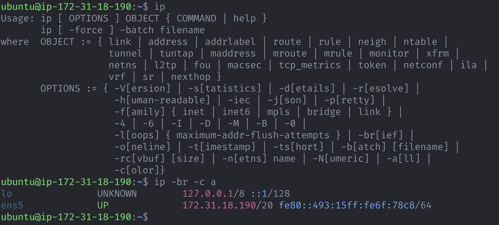

The default `ip addr` command, which gives you ip address of your device, is cluttered with alot of values, which may not be useful to you. To quickly get the output, you can pass the `-br` or `--brief` argument, which outputs a brief of the network statistic.

Additionally you can get color output by passing the `-c` or `--color` argument.

