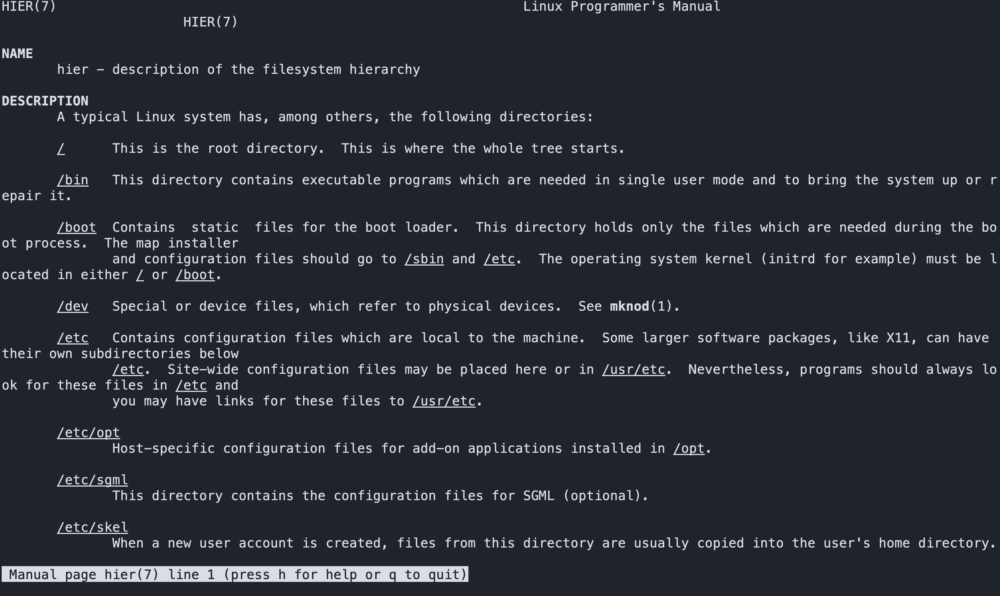

It is often tough to know where certain kinds of files or applications are in the Linux files system.

It is complicated due to historical reasons, and different distributions often put their files in different locations.

A good way to know where things are, or where things go, is by referring to your distribution's man pages.

`man hier`

