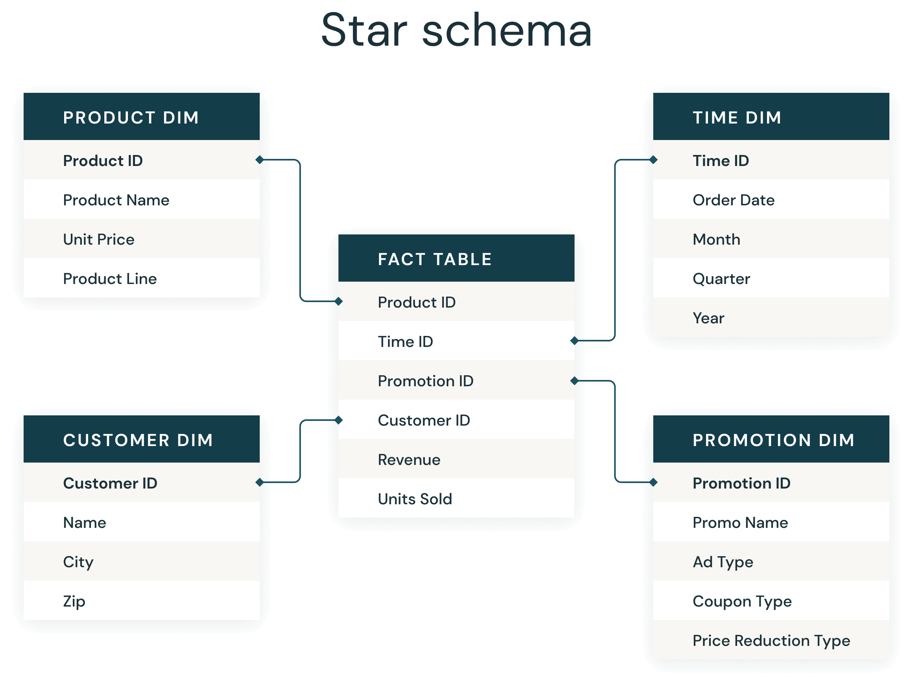

### Standardization Needs 

When a data warehouse is designed, it may get data from several source systems and each source may have its own names, data types etc. These anomalies can be eliminated if a proper standardization is maintained across the organization.

### Table Names Standardization:

Giving a full name to the tables, will give an idea about data what it is about. Generally, do not abbreviate the table names; however this may differ according to organization’s standards. If the table name’s length exceeds the database standards, then try to abbreviate the table names. Some general guidelines are listed below that may be used as a prefix or suffix for the table.

### Examples:

**Lookup** – LKP – Used for Code, Type tables by which a fact table can be directly accessed.

e.g. Credit Card Type Lookup – CREDIT_CARD_TYPE_LKP

**Fact** – FCT – Used for transaction tables:

e.g. Credit Card Fact – CREDIT_CARD_FCT

**Cross Reference** – XREF – Tables that resolves many to many relationships.

e.g. Credit Card Member XREF – CREDIT_CARD_MEMBER_XREF

**History** – HIST – Tables the stores history.

e.g. Credit Card Retired History – CREDIT_CARD_RETIRED_HIST

**Statistics** – STAT – Tables that store statistical information.

e.g. Credit Card Web Statistics – CREDIT_CARD_WEB_STAT

### Column Names Standardization:

Some general guidelines are listed below that may be used as a prefix or suffix for the column.

### Examples:

**Key** – Key System generated surrogate key.

e.g. Credit Card Key – CRDT_CARD_KEY

**Identifier** – ID – Character column that is used as an identifier.

e.g. Credit Card Identifier – CRDT_CARD_ID

**Code** – CD – Numeric or alphanumeric column that is used as an identifying attribute.

e.g. **State Code** – ST_CD

**Description** – DESC – Description for a code, identifier or a key.

e.g. State Description – ST_DESC

**Indicator** – IND – to denote indicator columns.

e.g. Gender Indicator – GNDR_IND

### Database Parameters Standardization:

Some general guidelines are listed below that may be used for other physical parameters.

### Examples:

**Index** – Index – IDX – for index names.

e.g. Credit Card Fact IDX01 – CRDT_CARD_FCT_IDX01

**Primary Key** – PK – for Primary key constraint names.

e.g. CREDIT Card Fact PK01- CRDT-CARD_FCT_PK01

**Alternate Keys** – AK – for Alternate key names.

e.g. Credit Card Fact AK01 – CRDT_CARD_FCT_AK01

**Foreign Keys** – FK – for Foreign key constraint names.

e.g. Credit Card Fact FK01 – CRDT_CARD_FCT_FK01
